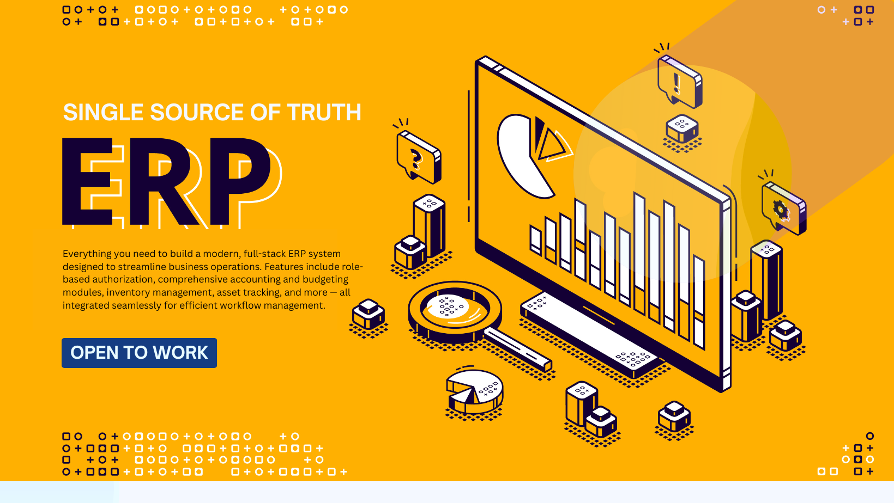

# ⚡️ ERP App ⚡️ — A Modern Full-Stack Enterprise Resource Planning System 
Everything you need to build a modern, full-stack ERP system designed to streamline business operations. Features include role-based authorization, comprehensive accounting and budgeting modules, inventory management, asset tracking, and more — all integrated seamlessly for efficient workflow management.



## 🚀 Tech Stack
This project combines powerful, modern tools to deliver a robust ERP foundation:

- 🔄 **[Remult](https://remult.dev/)** – Full-stack, type-safe CRUD & real-time capabilities  
- 🧩 **[Angular](https://angular.dev/)** – Reactive, component-based frontend framework  
- ⚙️ **[NestJS](https://nestjs.com/)** – Scalable and maintainable backend framework  
- 💽 **[MySQL](https://www.mysql.com/)** – Reliable relational database  
- 🎨 **[Tailwind CSS](https://tailwindcss.com/)** – Utility-first styling framework  
- 🧱 **[PrimeNG](https://primeng.org/)** – Rich UI component library for Angular  

> 💡 This project is modular and built for extensibility — ideal for open-source collaboration or private customization.

---

## 📦 Prerequisites

Before getting started, ensure the following are installed:

- **Node.js v20+**
- **npm** (comes with Node.js)
- **MySQL Server**

---

## 📥 Installation

1. **Clone the repository**  
   ```bash
   git clone https://github.com/infolinematrix/erp-app.git
   cd erp-app
   npm install


### 🛠 Configuration & Environment Variables

You'll need to set up some **environment variables** in your `.env` file. 
You can use [.env.example](./.env.example) as an example.


### 🧑‍💻 Running the Dev Environment

To develop locally, you'll need to run both the frontend and backend environments. This requires **two terminal windows**.

1. In **Terminal 1**, run the frontend development server:

   ```bash
   npm run dev
   ```

   This will start the frontend development environment and automatically open your app in the browser.

2. In **Terminal 2**, run the backend development server:

   ```bash
   npm run dev-node
   ```

   This will start the backend in watch mode, automatically restarting on code changes.


### 🚢 Production-Ready

When you're ready to go live, here's how to prepare:

#### Build for production:

```bash
npm run build
```

#### Run the production server:

```bash
npm run start
```

## 🤝 Collaboration
We welcome contributions from the community! If you're interested in collaborating on this project, please feel free to fork the repository, open issues, or submit pull requests.
